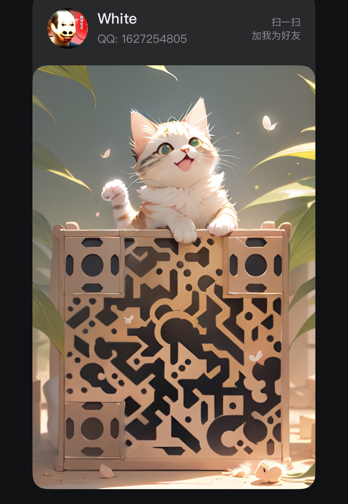
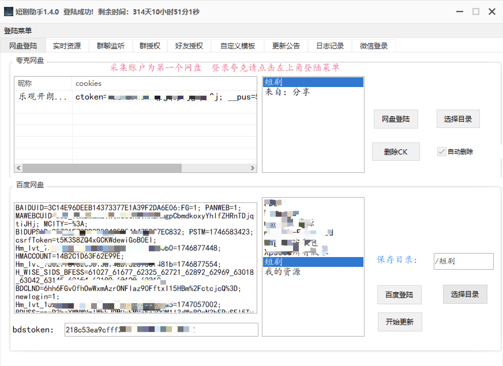
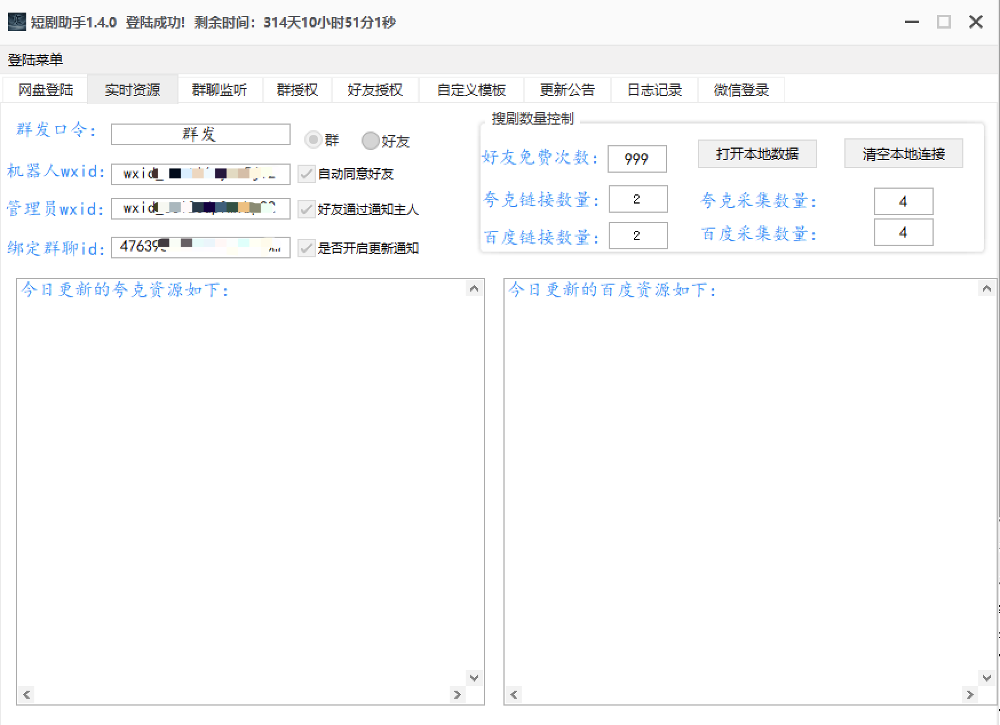
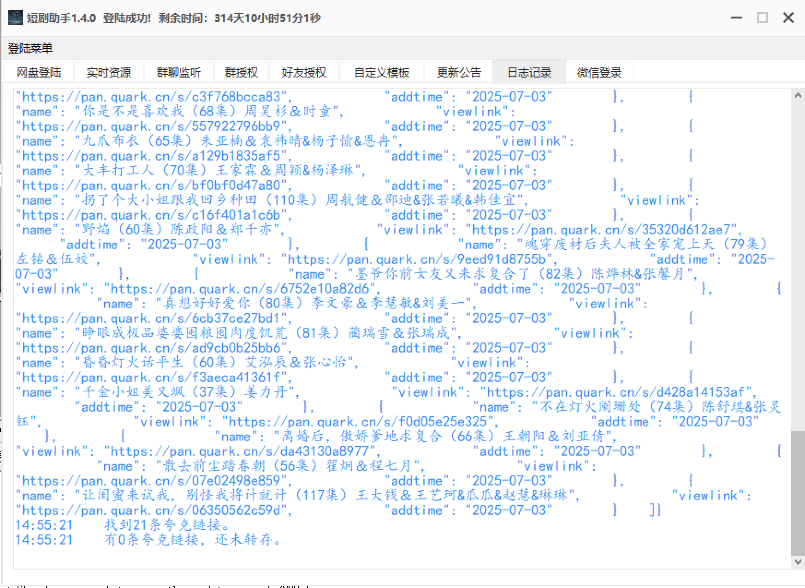

# 🎬 短剧机器人插件（WeChat ShortDrama Bot）

## 📌 项目简介

一款基于 **微信生态** 的全自动短剧搜索与资源转发插件，**永久免费使用**，内置万部热门短剧资源，对接全网资源查询，支持百度网盘、夸克网盘自动转存与分享,自动同意好友，自动发送群邀请等。适用于个人使用、群聊运营、影视分发、推广引流等多种场景。

---

## 🚀 功能特色

### 🎞️ 短剧影视搜索
- 支持百度网盘、夸克网盘双平台资源
- 每日自动更新最新短剧
- 本地无资源时，自动调用接口转存再分享

### 🤖 自动化引流
- 自动通过微信好友请求  
- 自动发送群邀请  
- 自动推送每日更新资源  
- 可配置一键群发资源更新

### 🔐 搜剧权限管理
- **好友授权**：可设置免费搜索次数或限制仅授权用户可搜剧  
- **群聊授权**：群聊内可限制是否允许成员搜索资源  

### 📢 群聊监听 + 自动转存
- 群聊中如出现网盘链接，自动识别并转存  
- 自动将转存资源回复到群聊或好友

### 📄 对接金山文档
- 每日资源更新后可自动同步到金山文档，便于用户浏览与收藏

### 🐦 自动发布微博
- 每日更新的热门短剧自动生成微博内容并推送发布

---

## 💰 使用与收费说明

**永久免费提供**。  
请勿将本插件用于任何非法用途，违者后果自负。

---

## 📥 插件下载方式

请添加作者微信或 QQ 获取最新版插件及相关配置说明。

### 微信：

### QQ：

---

## 🖥️ 插件运行截图

### 示例 1

---

### 示例 2

---

### 示例 3

---

### 示例 4

---

### 示例 5

---

## 📢 声明

> 本项目仅供学习参考，严禁用于违法或商业用途。  
> 使用过程中产生的一切法律责任与本项目作者无关。  
> 如涉及侵权，请联系作者。

---

## 📬 联系作者

如需交流、获取最新版本、技术支持或资源分享，请联系作者：

- 微信：**18790116355**
- QQ：**1627254805**

---

欢迎大家一起交流改进，如果你有优化建议或想参与开发，可以提交 Issues 或 PR 🙌
